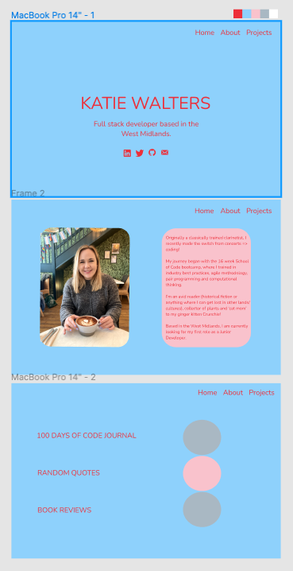

# PORTFOLIO

### 👉 [Click here for live demo](https://katiewalters.co.uk/)

### To install dependencies:

`npm i`

### To start the project:

`npm start`

### Tech stack:
 

 

## PLANNING/INSPIRATION 

 When designing my portfolio, I used Miro to create an inspiration board:

 
 

## LOW FI WIREFRAME

From looking at other portfolios, I loved the idea of bold colors, a basic layout, and some animation.

With this knowledge I created my low fi wireframe:
 
  

## HIGH FI WIREFRAME

I used Figma to create my initial High Fi wireframe:
  

🌸 🌸 🌸

I was heavily inspired by the 'Diablo Outdoor' website (see Inspiration section above) and took my colour palette from this. I also really liked the pink blossom on their pictures and, combined with my hope to make my page quite simply yet animated, I researched 'CSS Cherry Blossoms'. After experimenting with several Codepens, I came across [TS Particles](https://codepen.io/collection/DPOage).

I couldn't find exactly what I was looking for (always the way!) so initially I got this one in place: [Grey Circles on White Background](https://codepen.io/matteobruni/pen/vYejMNr) then I had great fun playing around with this one: [Rainbow Confetti](https://codepen.io/matteobruni/pen/zYwQVxM) and used some of the confetti styling to tweak the circles into looking more like blossom. (Am aware this wasn't fully successful... but I've made peace with that and like my confetti blobs 💕)

📚 📚 📚

In order to inject some of my personality into my portfolio I had to include a nod towards my love of reading. I woke up at 4am one night (please tell me I'm not the only one this happens to?!) with the sudden idea to display each of the projects 'as a book'.

 I researched various codepens/read some articles, and [this one](https://codepen.io/diemoritat/pen/LKROYZ) was by far my favourite. I then updated the high fi wireframe, and included how it would look on mobile:
  

## REFLECTION

If I were to begin this process again from scratch I would:
- spend more time on the wireframes. I had a solid vision of the colour pallete and how the title would look, but everything else was trial and error/made up as I went along.

If I have time for improvements I will:
- useContext for dark mode to remove unnecessary prop drilling

